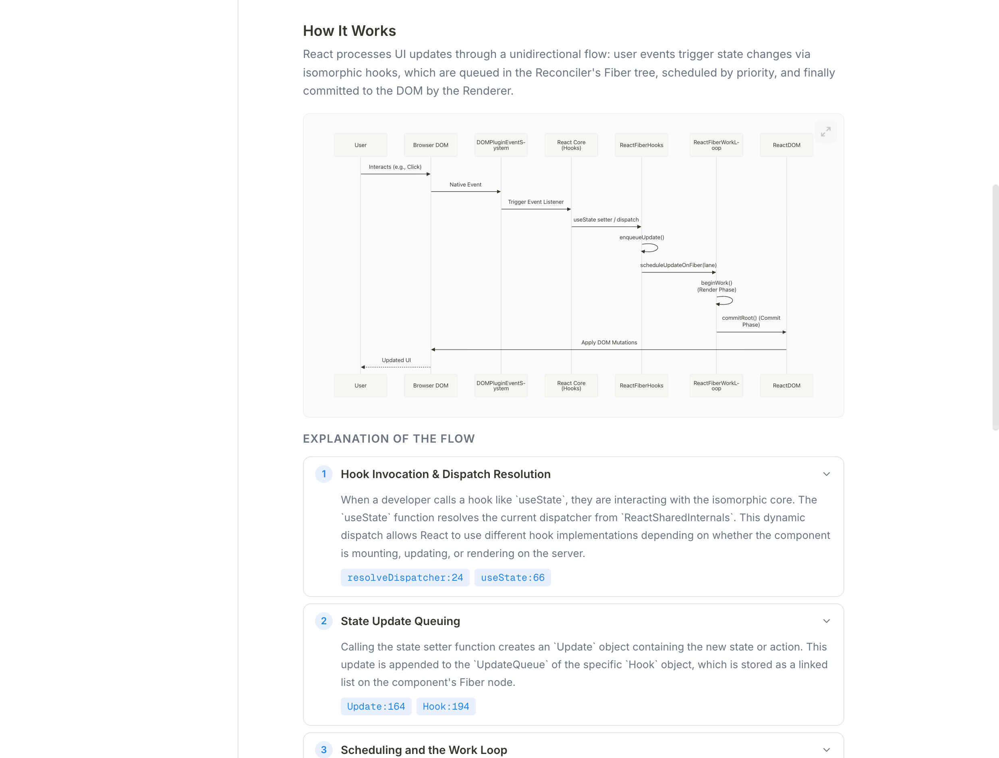
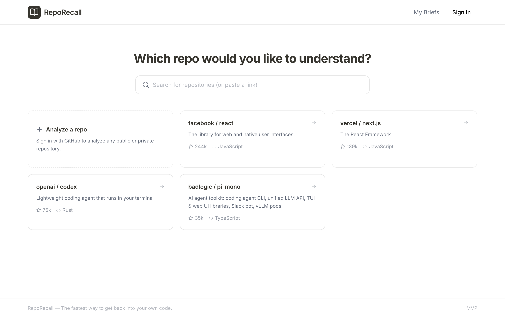
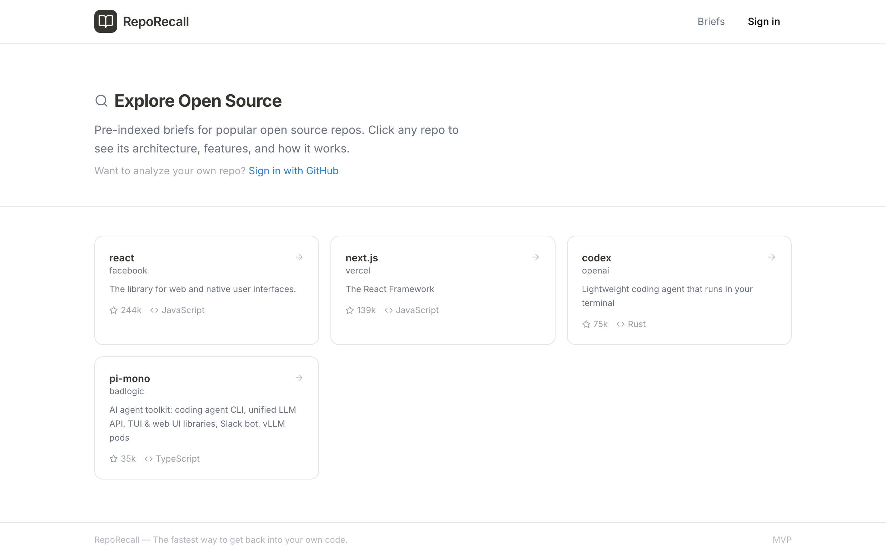
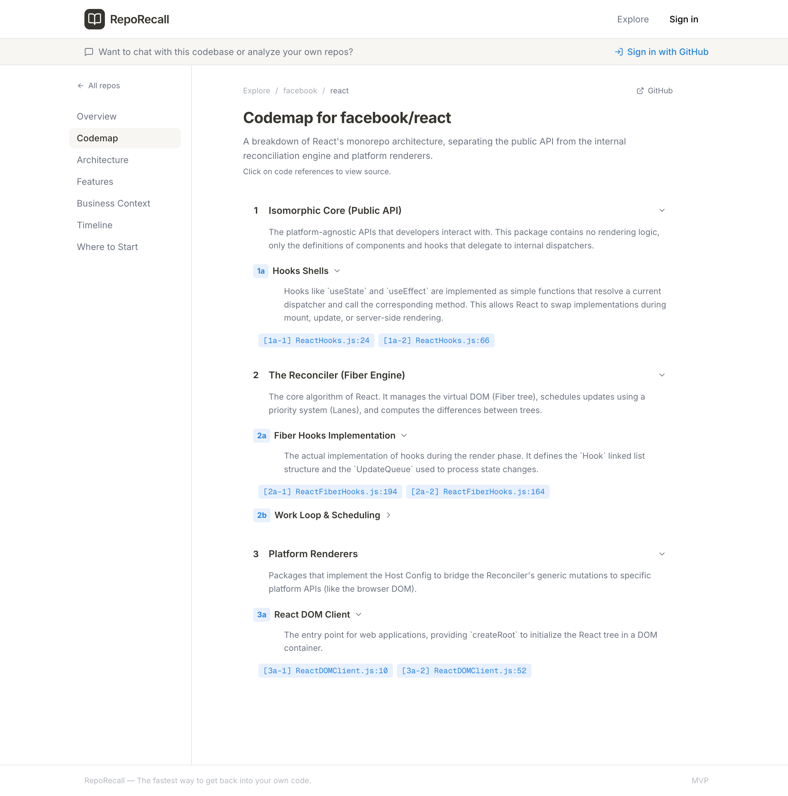
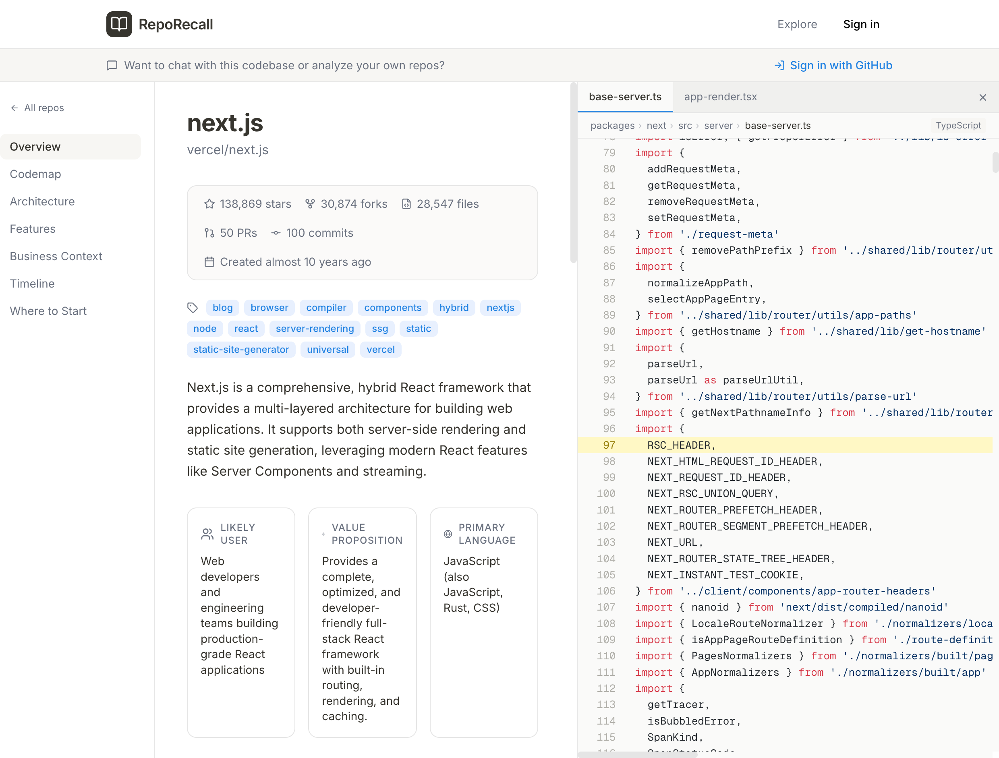
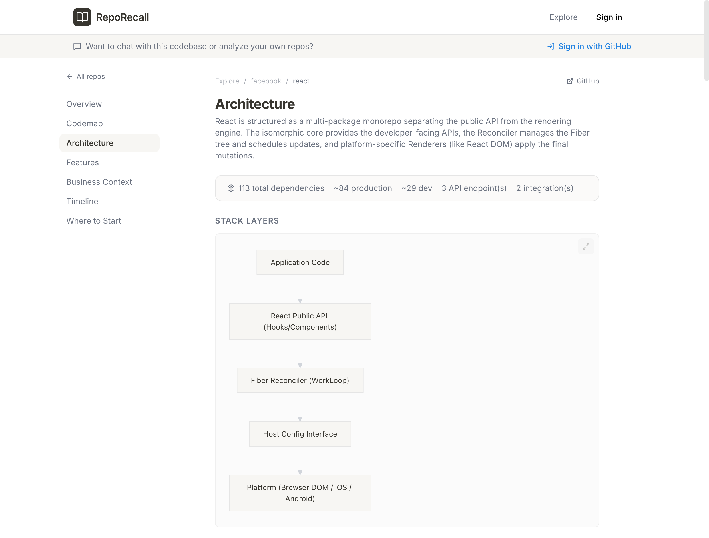
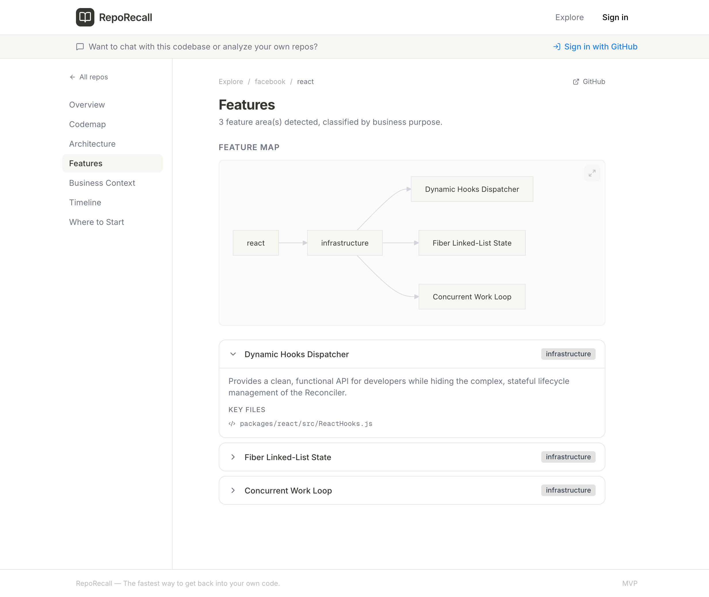
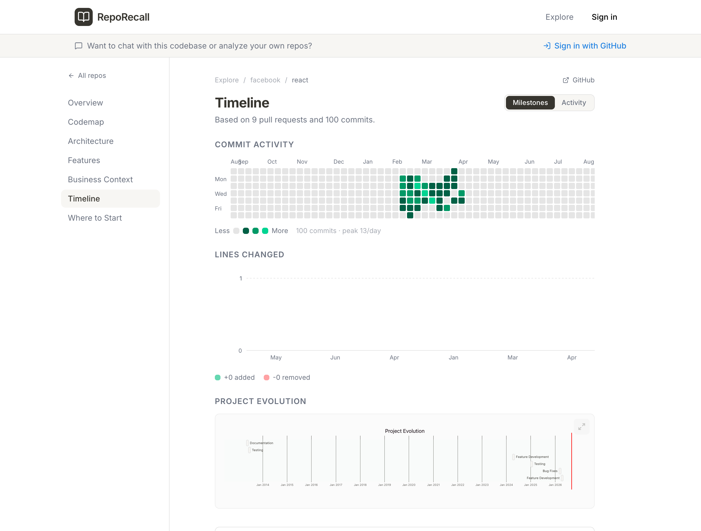
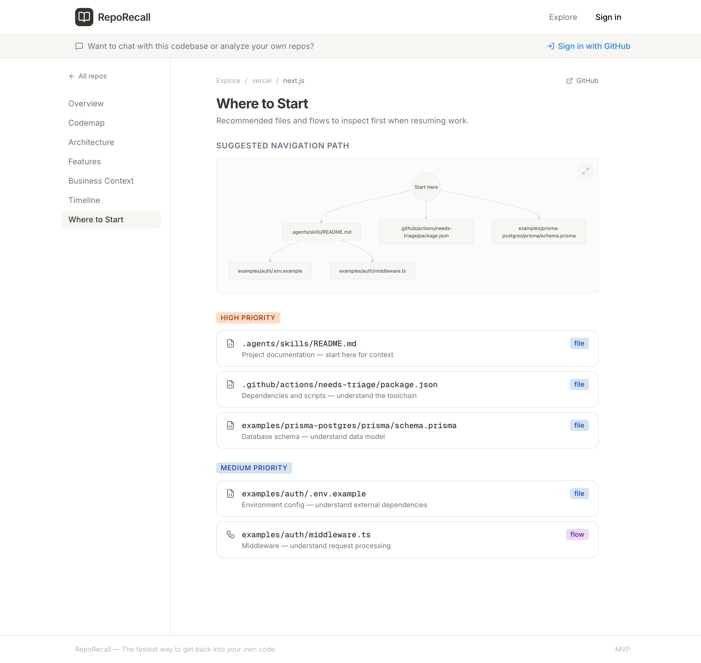

<h1 align="center">RepoRecall</h1>

<p align="center">
  <strong>Get back into your own code.</strong><br>
  Point it at a GitHub repo and an LLM explores the codebase with real tools —
  reading files, grepping, searching semantically — then writes you a structured
  brief: how it works, how it's built, and where to start reading.
</p>

<p align="center">
  
  
  
  
  
  
</p>

> [!IMPORTANT]
> **This project is not actively maintained.**
>
> It is published as-is, for reference and for forking. Issues and pull requests
> may not receive a response, and there is no roadmap, release schedule, or
> support commitment. The hosted instance at
> [reporecall.com](https://reporecall.com) carries no uptime guarantee and may
> change or disappear without notice.
>
> The code works — see [Known limitations](#known-limitations) for the rough
> edges it ships with — but if you want to build on it, **fork it** and expect
> to maintain your own copy. The [MIT license](LICENSE) permits that freely.

<p align="center">
  
</p>

---

## Why

Six months away from a project and your own code reads like someone else's. The
README documents intent, not the current state. The file tree tells you nothing
about which of those 300 files actually matter. So you spend the first two hours
just rebuilding the mental model you already had.

Existing tools don't quite solve this. A README is stale by construction. Asking
a chat model to "explain this repo" gets you a plausible summary built from the
handful of files that fit in context. What you actually want is something that
*goes and looks* — opens the entrypoints, follows the imports, finds where the
request handling lives — and then reports back.

That's what RepoRecall does. It runs an LLM in a tool-calling loop against the
GitHub API, gives it a budget, and lets it explore until it understands the
shape of the thing. Then a second, stronger model turns those findings into a
brief: a summary, an architecture map, a feature inventory, a hierarchical code
map where every claim cites a real `file:line`, and a ranked list of where to
start reading.

> [!NOTE]
> The screenshots below are real output from the hosted instance at
> [reporecall.com](https://reporecall.com), not mockups. They also show real
> rough edges — see [Known limitations](#known-limitations), which is worth
> reading before you trust a brief.

## Features

- **Agentic exploration, not a single prompt.** The model drives its own investigation through five tools — `readFile`, `readFileLines`, `searchCode`, `listDirectory`, and `searchSemantic` — for up to 35 turns against a hard budget of 120 GitHub API calls.
- **Semantic code search.** Repo files are chunked (code-aware, ~300 tokens with 50-token overlap), embedded via `openai/text-embedding-3-small` at 256 dims, and searched by cosine similarity, so the agent can look for *concepts* and not just string matches.
- **Citations, not vibes.** Code map nodes and flow-explanation steps carry `Citation` objects pointing at specific files and line ranges, rendered as clickable refs that open the source inline.
- **Generated diagrams.** Synthesis emits Mermaid for an overview flow, architecture, stack layers, data flow, and ER diagrams. Every diagram is parsed and validated before it makes it into a brief — invalid Mermaid is dropped rather than rendered broken.
- **Structured brief, not a wall of text.** One `ProjectBrief` covers overview, architecture, features (classified by business purpose), business context, an evolution timeline, entrypoints, and a code map.
- **Ask follow-up questions.** Chat over a brief does RAG retrieval against the cached embeddings for the exact commit the brief was pinned to, so answers are grounded in the same snapshot you're reading.
- **Deep mode.** A second exploration cycle that runs gap analysis on the first pass, then spends another 80 API calls closing the gaps it found — bounded by a hard 270s deadline to stay inside Vercel's 300s function limit.
- **Public briefs.** Pre-indexed open-source repos are browsable without an account at `/explore`.

## Screenshots

### Start from a repo
Paste a URL or pick one of the pre-indexed repos.



### Browse pre-indexed open source
Public briefs need no account.



### Code map
A hierarchical breakdown of the codebase. Every leaf cites the source it was derived from — click a ref to read the code without leaving the page.



### Read the cited source
Clicking a code ref opens the file in a side panel, syntax-highlighted and scrolled to the cited line — one tab per citation, so you can compare two call sites without leaving the brief.



> [!NOTE]
> This is the **signed-in** experience. The "Sign in with GitHub" banner is
> visible because the shot was taken against a local dev server with
> `DEV_BYPASS_AUTH` — that flag bypasses auth server-side but leaves the
> client-side nav rendering as signed-out. Anonymous visitors on the hosted
> site currently get a load error here; see [Known limitations](#known-limitations).

### Architecture
Stack layers, module relationships, and integrations, plus the dependency inventory.



### Features
Feature areas detected in the code, each classified by business purpose and mapped to the files that implement it.



### Timeline
Commit activity, and milestones inferred from merged PRs.



### Where to start
A priority-ranked reading order for getting oriented.



## How an analysis runs

```
POST /api/analyze  (SSE, maxDuration 300s)
  │
  ├─ fetch repo metadata, tree, PRs, commits          src/lib/github.ts
  ├─ seed the embedding store from high-signal files  vectorSearch.ts
  │
  ├─ EXPLORATION LOOP  ≤35 turns · 120 API calls      orchestrator.ts
  │    model: AGENT_EXPLORATION_MODEL                 (default gemini-3-flash-preview)
  │    tools: readFile · readFileLines · searchCode
  │           listDirectory · searchSemantic          executor.ts / tools.ts
  │
  ├─ [deep mode only] gap analysis → cycle 2
  │    ≤20 more turns · +80 API calls · 270s deadline
  │
  ├─ SYNTHESIS                                        prompts.ts
  │    model: AGENT_SYNTHESIS_MODEL                   (default gemini-3.1-pro-preview)
  │    → ProjectBrief + Mermaid diagrams
  │
  ├─ validate every diagram, drop the invalid ones
  └─ persist to Supabase                              store.ts
```

Progress is reported as `ProgressEvent`s over SSE, which is what drives the
live progress UI while an analysis runs.

## Getting started

**Prerequisites:** Node.js 20.9+, a [Supabase](https://supabase.com) project, and
an [OpenRouter](https://openrouter.ai) API key.

```bash
git clone https://github.com/trippuroskie/repo-recall.git
cd repo-recall
npm install

cp .env.example .env.local
# fill in Supabase + OpenRouter, at minimum

npm run dev
```

Open <http://localhost:3000>.

### Database setup

Apply the migrations in `supabase/migrations/` **in numeric order**, via the
Supabase SQL editor or `supabase db push`. Migration `009` creates the
`repo_embeddings` table and requires the `pgvector` extension; without it,
semantic search still works but falls back to in-memory-only embeddings that are
re-computed on every analysis.

### Minimum environment

| Variable | Needed for |
| --- | --- |
| `NEXT_PUBLIC_SUPABASE_URL`, `NEXT_PUBLIC_SUPABASE_ANON_KEY` | Everything |
| `SUPABASE_SERVICE_ROLE_KEY` | Server-side brief reads/writes. **Server-only.** |
| `OPENROUTER_API_KEY` | Exploration, synthesis, embeddings, chat |
| `GITHUB_TOKEN` | Optional server-side fallback. Without a token you get GitHub's 60 req/hr unauthenticated limit, well under the 120-call budget a single analysis can spend. |
| `ADMIN_SECRET` | Only the admin indexing endpoint |
| `STRIPE_*` | Only billing |

`.env.example` documents all of them. See [Configuration](#configuration) for
the optional model overrides.

### Working without signing in

Set `DEV_BYPASS_AUTH=true` in `.env.local` to skip Supabase auth locally. It
substitutes a fixed mock user and is double-gated on `NODE_ENV=development`, so
it can't be enabled in a production build. The client-side nav still shows
"Sign in" under the bypass — only server routes are bypassed.

## Configuration

Two models are used, and both are overridable with any OpenRouter model ID:

| Variable | Default | Role |
| --- | --- | --- |
| `AGENT_EXPLORATION_MODEL` | `google/gemini-3-flash-preview` | Runs the tool-calling loop. Many turns, so favor fast and cheap. |
| `AGENT_SYNTHESIS_MODEL` | `google/gemini-3.1-pro-preview` | Runs once to write the brief. Favor capability. |

Analytics are **off by default**. The Umami snippet loads only in production
builds and only when *both* `NEXT_PUBLIC_UMAMI_SCRIPT_URL` and
`NEXT_PUBLIC_UMAMI_WEBSITE_ID` are set, pointing at an instance you control. A
fresh clone or fork ships with no tracking.

## Cost and rate limits

An analysis is not free, and the cost scales with how much the agent decides to
read:

- **Exploration** is the dominant cost: up to 35 LLM turns, each carrying accumulated tool output. Deep mode adds up to 20 more.
- **Embeddings** are computed once per (repo, commit) and cached in `repo_embeddings`, so re-analyzing the same commit is much cheaper than the first run.
- **GitHub API** calls are hard-capped at 120 per analysis (200 in deep mode). Files over 100KB are refused with a hint to use `readFileLines` instead.

Start with a small repo in standard mode before pointing it at a monorepo.

## Security

- **Server/client split matters here.** `SUPABASE_SERVICE_ROLE_KEY`, `OPENROUTER_API_KEY`, Stripe secrets, and any Octokit instance holding a user token are server-side only. Client code uses the anon key via `createClient()`. `createServiceClient()` bypasses row-level security — it exists for server routes that legitimately need it, not as an escape hatch around an inconvenient RLS policy.
- **Never commit `.env.local`.** `.gitignore` covers `.env` and every `.env.*` variant except `.env.example`.
- **`ADMIN_SECRET` fails closed.** `/api/admin/index` requires a `Bearer` match and returns 500 rather than running if the secret is unset. It is deliberately exempt from the auth middleware, so it is only as strong as that secret — generate it with `openssl rand -hex 32`.
- **User GitHub tokens are stored per-profile** to analyze private repos. Self-hosting means taking on custody of those tokens; scope them narrowly.
- **Briefs quote source code.** A brief for a private repo contains excerpts from it. Treat the `briefs` table with the same sensitivity as the repos it describes, and check any brief output before pasting it into an issue.

## Known limitations

Worth knowing before you rely on a brief:

- **Source refs don't resolve for anonymous visitors.** `/api/file` is treated as a protected route by the auth middleware, so clicking a citation on a *public* brief returns 401 and the viewer shows "Could not load …". Signed-in users are unaffected. Making the endpoint public would also turn the deployment into an unauthenticated proxy for arbitrary public GitHub file reads, so this needs a scoped fix (validate the path against the brief's citations) rather than a one-line exemption.
- **"Lines changed" is always empty.** The timeline chart renders `+0 / -0` because the PR objects it reads never carry `additions`/`deletions` — the list endpoint doesn't return them and they're never backfilled per PR. The commit-activity heatmap is real; the lines-changed chart is not.
- **Entrypoint ranking is pattern-based, not semantic.** It matches on filename conventions, so in a large monorepo it can surface `.github/actions/*/package.json` or an `examples/` file as "high priority" while missing the actual core module. Treat it as a starting hint.
- **Timelines are sampled, not complete.** Analysis reads the 50 most recent PRs and 100 most recent commits. For a repo with 13 years of history, "recent milestones" means recent, and inferred milestones are labeled `isInferred` for a reason.
- **Feature detection is shallow on large repos.** All four seeded briefs detected exactly three feature areas, which says more about the synthesis prompt's output shape than about the codebases.
- **No evaluation harness.** There is no way to measure whether a prompt change makes briefs better. Changes are judged by reading the output.
- **Deep mode is Pro-gated in the hosted app.** That's a billing decision in `/api/analyze`, not a technical limit — self-hosted, both modes are available.
- **No tests.** Not one. See [CONTRIBUTING.md](CONTRIBUTING.md#worth-doing-in-a-fork).

## Project structure

```
src/
  app/
    api/analyze/         Analysis entry point (SSE, maxDuration 300)
    api/chat/            RAG chat over a brief
    api/explore/         Public briefs (no auth)
    api/file/            Source fetch for citation refs
    api/admin/index/     Bearer-protected public-brief indexing
    explore/[owner]/[repo]/  Public brief page
    brief/[id]/          Private brief page
  lib/
    agent/
      orchestrator.ts    runAgenticAnalysis; standard vs deep; synthesis
      executor.ts        ToolExecutor — tool calls to GitHub API; call budget
      tools.ts           Tool schemas exposed to the model
      prompts.ts         Exploration, synthesis and gap-analysis prompts
      vectorSearch.ts    EmbeddingStore — chunking, embeddings, cosine search
    supabase/            createClient (anon) / createServiceClient (service role)
    store.ts             Brief read/write
    types.ts             ProjectBrief and friends
  components/sections/   One component per brief section
supabase/migrations/     Numbered SQL migrations — apply in order
docs/                    PRD, research notes, roadmap plans
```

See [AGENTS.md](AGENTS.md) for conventions and the mechanics of common changes —
it's written for AI coding agents but is the fastest orientation for humans too.

## Forking and contributing

**This repo is not actively maintained**, so the realistic path is to fork it.
[CONTRIBUTING.md](CONTRIBUTING.md) documents the setup, the conventions, and the
constraints worth knowing before you change the agent loop — useful whether or
not anything comes back upstream.

If you do open a PR, it may sit unreviewed. That's not a judgment on the work;
there's simply nobody committed to triaging it.

The highest-value things to tackle in a fork: a first test suite, an evaluation
harness for brief quality, and a scoped fix for the citation-loading bug in
[Known limitations](#known-limitations).

## License

[MIT](LICENSE)
