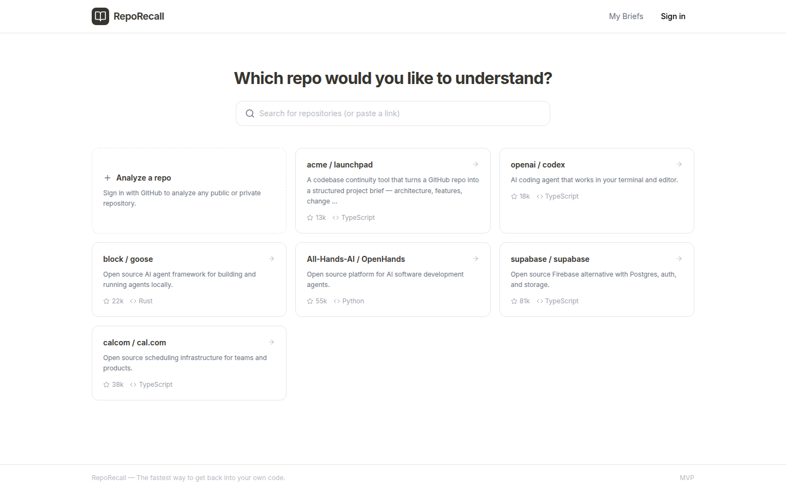
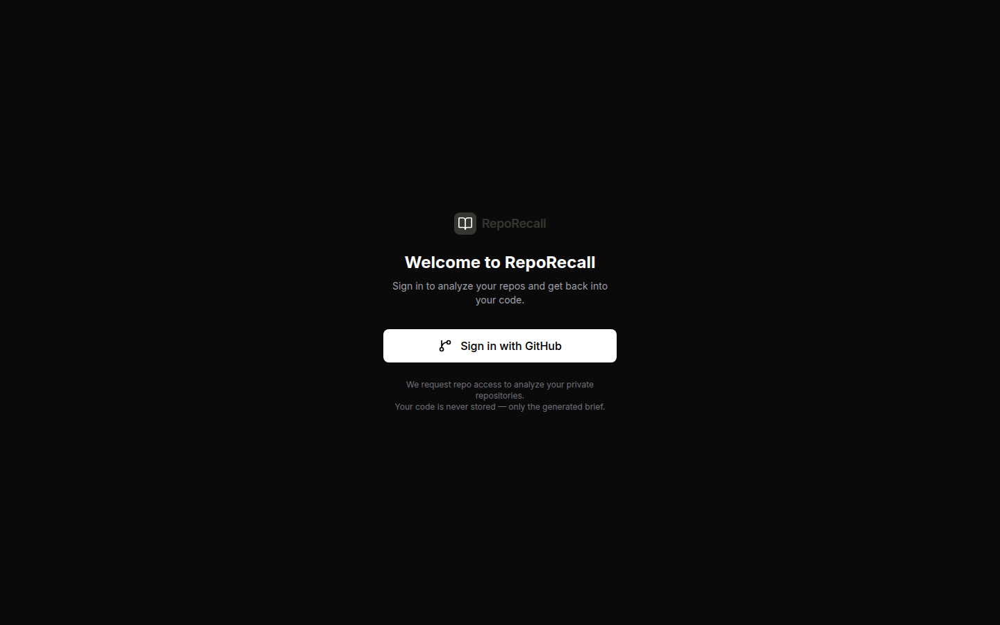
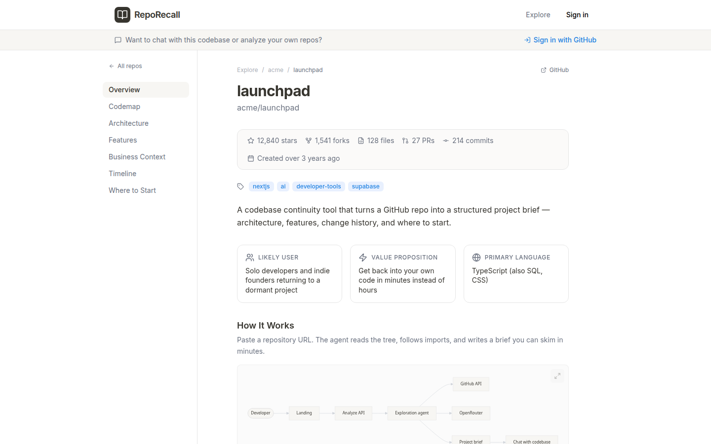
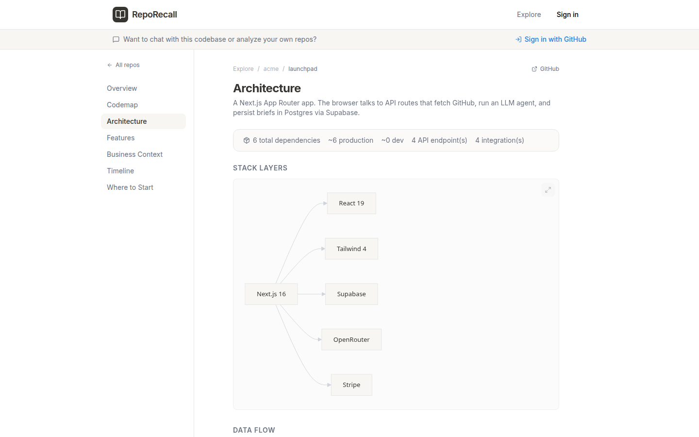
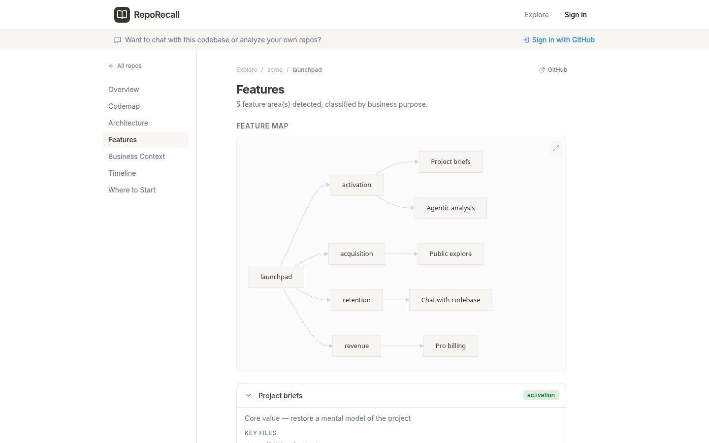
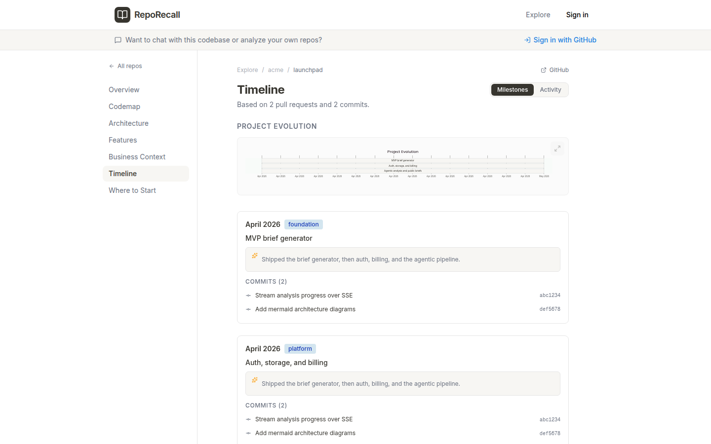
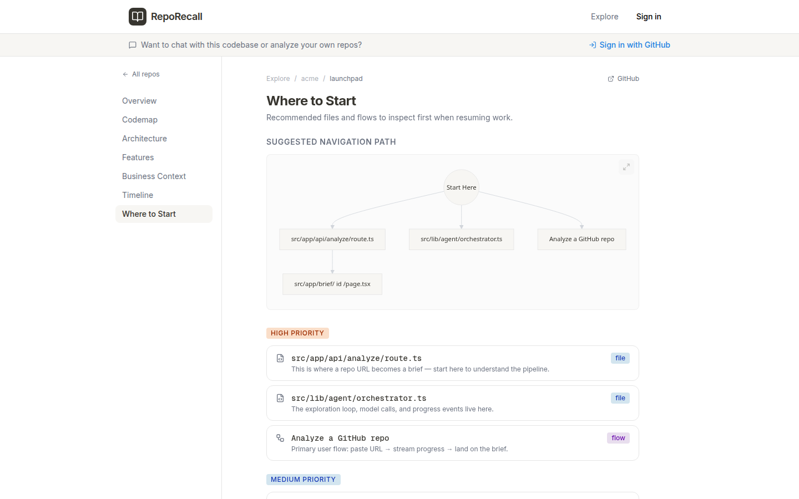
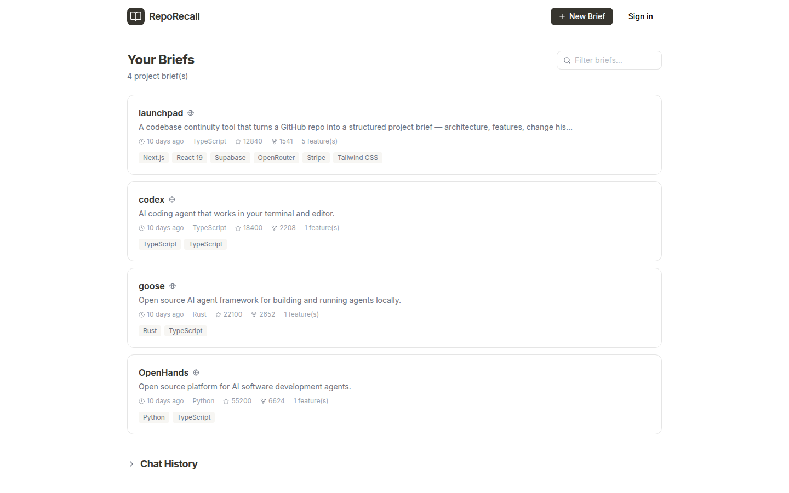
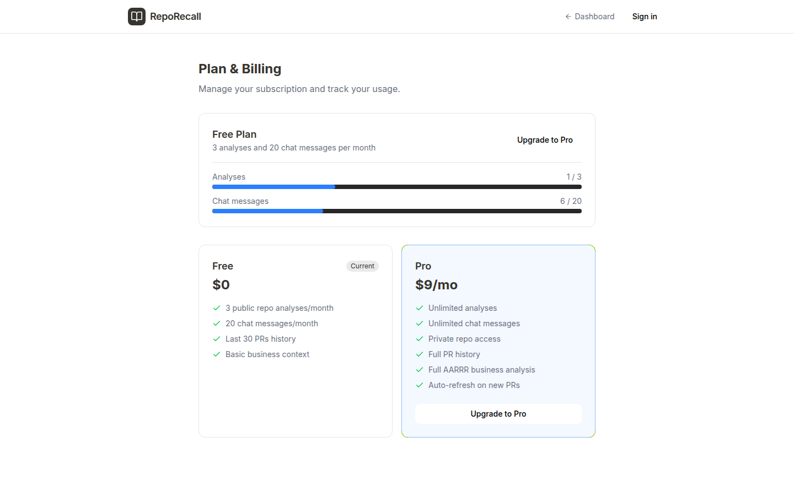

# RepoRecall

The fastest way to get back into your own code.

RepoRecall generates a structured **project brief** from a GitHub repository: what the project does, how it is built, what changed, and where to start. Browse pre-indexed public repos without an account, or sign in with GitHub to analyze your own.

## Screenshots

Example product UI (sample brief data).

**Home** — search a GitHub repo or open a pre-indexed public brief.



**Sign in** — GitHub OAuth. Repo contents are not stored; only the generated brief is.



**Overview** — product summary, stats, and how the system works.



**Architecture** — stack, integrations, and generated diagrams.



**Features** — feature map classified by business purpose.



**Timeline** — milestones from PRs and commits.



**Where to start** — recommended files and flows for re-entry.



**Your briefs** — saved analyses after you sign in.



**Billing** — free tier usage and Pro plan.



## Features

- **Project briefs** — overview, architecture, features, business context, change timeline, and recommended entrypoints
- **Agentic analysis** — an LLM explores the repo (read/search files) and synthesizes a brief with diagrams
- **Deep Research** — multi-cycle analysis for Pro users
- **Chat** — ask questions about a brief, grounded in the generated context and code embeddings
- **Public explore** — pre-indexed open-source repos anyone can browse
- **Auth and billing** — GitHub OAuth via Supabase Auth; optional Stripe Pro plan

## Stack

- [Next.js](https://nextjs.org) 16 (App Router) + React 19 + Tailwind CSS 4
- [Supabase](https://supabase.com) (Postgres, Auth, Row Level Security)
- [OpenRouter](https://openrouter.ai) for LLM and embedding calls
- [Stripe](https://stripe.com) for subscriptions
- GitHub API via Octokit

## Quick start

### Prerequisites

- Node.js 20+
- A [Supabase](https://supabase.com) project
- An [OpenRouter](https://openrouter.ai/keys) API key
- Optional: Stripe account, GitHub token (for indexing public repos / higher rate limits)

```bash
git clone https://github.com/trippuroskie/repo-recall.git
cd repo-recall
npm install
cp .env.example .env.local
```

Fill in `.env.local` (see [Environment variables](#environment-variables)), apply the database migrations, then:

```bash
npm run dev
```

Open [http://localhost:3000](http://localhost:3000).

## Database

Apply every file in `supabase/migrations/` **in numeric order** (001 → 011) to your Supabase project. You can paste them into the SQL editor or use the [Supabase CLI](https://supabase.com/docs/guides/cli):

```bash
npx supabase db push
```

Enable the **GitHub** provider in Supabase Auth → Providers. Callback URL:

```
https://<your-supabase-project>.supabase.co/auth/v1/callback
```

Add your app origin (e.g. `http://localhost:3000` and your production URL) under Auth → URL configuration.

## Environment variables

Copy `.env.example` and set:

| Variable | Required | Purpose |
|---|---|---|
| `NEXT_PUBLIC_SUPABASE_URL` | Yes | Supabase project URL |
| `NEXT_PUBLIC_SUPABASE_ANON_KEY` | Yes | Supabase anon/public key |
| `SUPABASE_SERVICE_ROLE_KEY` | Yes | Server-only. Bypasses RLS. Never expose to the browser. |
| `OPENROUTER_API_KEY` | Yes | LLM analysis and chat |
| `STRIPE_SECRET_KEY` | For billing | Stripe secret key |
| `STRIPE_WEBHOOK_SECRET` | For billing | Stripe webhook signing secret |
| `NEXT_PUBLIC_STRIPE_PUBLISHABLE_KEY` | For billing | Stripe publishable key |
| `STRIPE_PRO_PRICE_ID` | For billing | Price ID for the Pro plan |
| `GITHUB_TOKEN` | Optional | Server fallback / public indexing (higher GitHub rate limits) |
| `ADMIN_SECRET` | For indexing | Bearer token for `POST /api/admin/index`. Generate with `openssl rand -hex 32`. |
| `DEV_BYPASS_AUTH` | Local only | Set to `true` to skip auth when `NODE_ENV=development`. **Never enable in production.** |
| `NEXT_PUBLIC_UMAMI_SCRIPT_URL` | Optional | Umami script URL (analytics disabled if unset) |
| `NEXT_PUBLIC_UMAMI_WEBSITE_ID` | Optional | Umami website id |
| `AGENT_EXPLORATION_MODEL` / `AGENT_SYNTHESIS_MODEL` | Optional | OpenRouter model overrides |
| `CHAT_MODEL` / `CHAT_MODEL_DEEP` | Optional | Chat model overrides |

Stripe webhook endpoint: `POST /api/webhooks/stripe`.

### Indexing public repos

```bash
curl -X POST http://localhost:3000/api/admin/index \
  -H "Authorization: Bearer $ADMIN_SECRET" \
  -H "Content-Type: application/json" \
  -d '{"repos":["vercel/ai"],"featured":true}'
```

This can take several minutes per repository.

## Security notes for self-hosters

- **Do not commit `.env.local`.** It is gitignored. Rotate any key that ever lands in git history.
- `SUPABASE_SERVICE_ROLE_KEY` and `ADMIN_SECRET` are full-privilege secrets. Treat them like production passwords.
- GitHub OAuth tokens are stored in Postgres (`profiles.github_access_token`). Protect the database; migration `011_harden_profiles.sql` blocks clients from reading or writing tokens and billing columns. Server routes use the service-role client for those fields.
- `DEV_BYPASS_AUTH` is ignored unless `NODE_ENV=development`.
- Report vulnerabilities privately (see [Security](#security)).

## Scripts

```bash
npm run dev      # development server
npm run build    # production build
npm run start    # serve the production build
npm run lint     # ESLint
```

## Contributing

Issues and pull requests are welcome.

1. Fork the repo and create a branch from `main`.
2. Use `.env.example` — never commit real keys.
3. Keep secrets and billing writes on the server (service-role client), not in browser code.
4. Run `npm run lint` before opening a PR.

Product and architecture notes live in `docs/` (some files are historical planning docs).

## License

[MIT](./LICENSE)

## Security

Please **do not** open public issues for security problems.

Email the maintainer via the GitHub profile on this repository, or open a [private GitHub security advisory](https://docs.github.com/en/code-security/security-advisories/guidance-on-reporting-and-writing/privately-reporting-a-security-vulnerability) if that is enabled.
